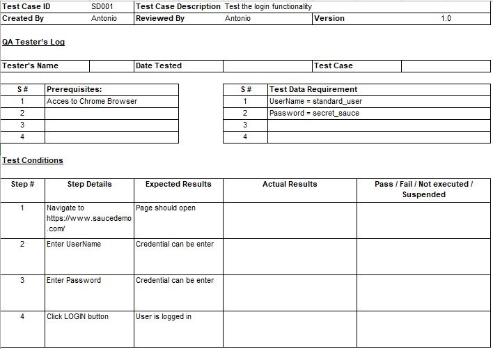
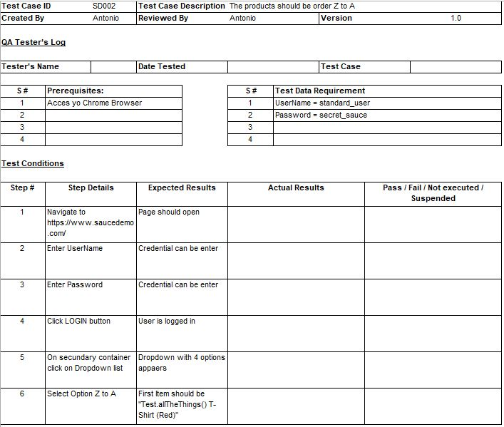

# PORTFOLIO

## Antonio Crespo
### Proyecto: Web Site Sauce Demo
### Automated Test Strategy
	Revision history
	Versión: 1.0
	Autor:  Antonio Crespo
	Description: Creation
	Date: Julio 2020
#### Index
1. Introduction.
2. Scope.
3. Ambient and Test Tools
	a. Test Tools.
	b. Test ambient.
4. Input and output criteria.
	a. Input criteria.
	b. Output critiria.
5. Test report
------------------
#### 1. Introduction

This Automated Testing Strategy describes the scope of testing, the testing environment, the resources required, the tools to use, the risks, contingency plans, and the test execution schedule for the Sauce Demo project.

#### 2. Scope

Black box tests (automated) will be carried out on the functionalities selected during the planning of each sprint.
The functionalities to be automated will be selected using the criteria of the Checklist "What test cases to automate".

#### 3. Ambient and test tools.

##### 3.a - Test tools

|TOOL|Function  |
|--|--|
|Mocha JUnit Reporter  |Report framework
|Cypress|Framework to automate web systems.

##### 3.b - Test ambient
|Browser|Operating System  |
|--|--|
|Chrome, Edge, Electron.|Windows 10  |

#### 4. Input and output criteria.

##### 4.a Input criteria.
The functionalities must be deployed in the QA environment and have been manually tested.
The testing framework is installed and ready to run.
QA environment is available.
Critical defects found during manual testing have been resolved and closed.

##### 4.b Output criteria.
Execution of all automated test cases.
Sufficient coverage of requirements and functionalities under testing has been achieved.
No high severity defect is open.

#### 5. Test Report
The Automatic Test Report will be obtained through Mocha JUnit. This Report will report on the results of the execution of each test case. It will include tests that passed and failed, errors found, success rate, and elapsed time.
 
-----
## Test cases examples:

